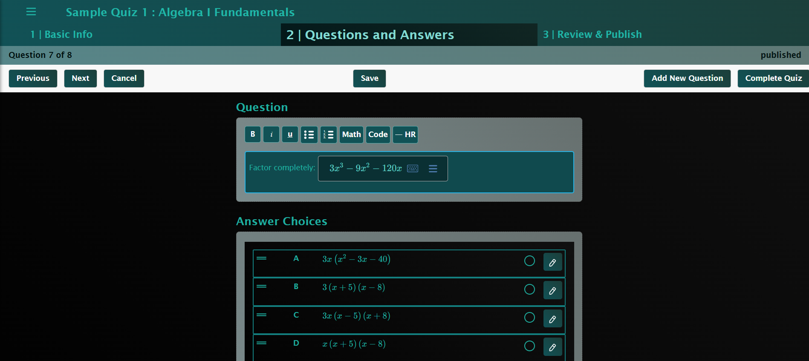
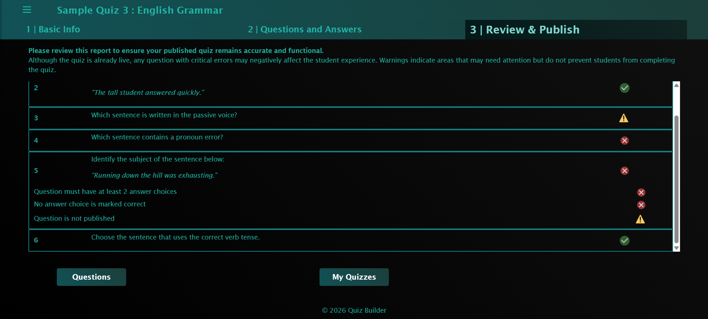
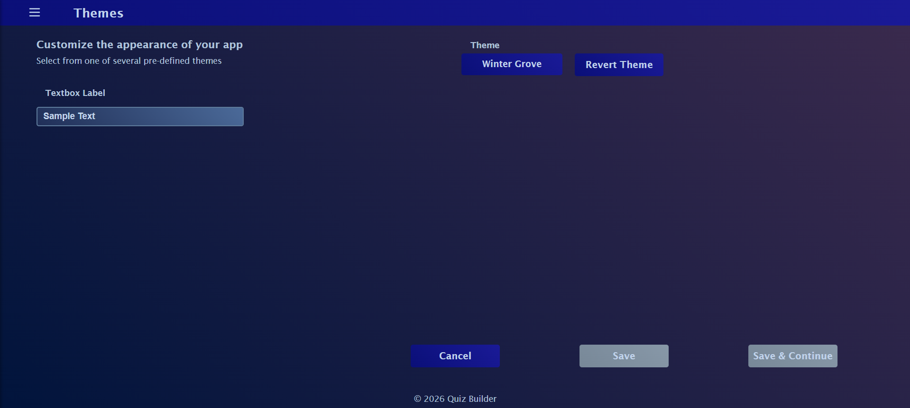

# Project Description

A full‑stack quiz and student assessment platform built with a React.js front‑end and a .NET 8 Web API back‑end.

## Live URL

https://www.mquizbymichelle.com/

## Tech Stack

**Front-end**
- React.js
- TypeScript
- Bootstrap

**Back-end**
- .NET 8 Web API
- C#
- Entity Framework Core
- SQL Server

## Deployment ##

- Front-end: Azure Static Web Apps
- Back-end: Azure Web App Service
- Database: Self‑hosted VPS

## Features ##

- Quiz editor with formatting and full math support, allowing instructors to create quizzes/assessments for a variety of subjects
- Supports multiple choice questions
- A report which validates that your quiz meets basic requirements, allowing for smoother quiz-taking exerience
- Theme selector with seven predefined themes, allowing users to customize the appearance of the app

## Future Development ##

- Quiz‑taking experience (in progress)
- Instructor assigning quizzes to students
- Numeric and verbal short answer questions

## Screenshots ##

- 
*The main quiz editor with full math support, formatting tools, and multiple‑choice question creation.*

- 
*The Review & Publish screen provides a detailed validation report, highlighting errors, warnings, and completed items.*

- 
*Seven predefined themes allow users to personalize the appearance of the app.*

## Disclaimer
This project is a personal portfolio application. It does not collect, store, or process any real student data, user accounts, or client information. All data used for testing and demonstration is fictional and for development purposes only.

